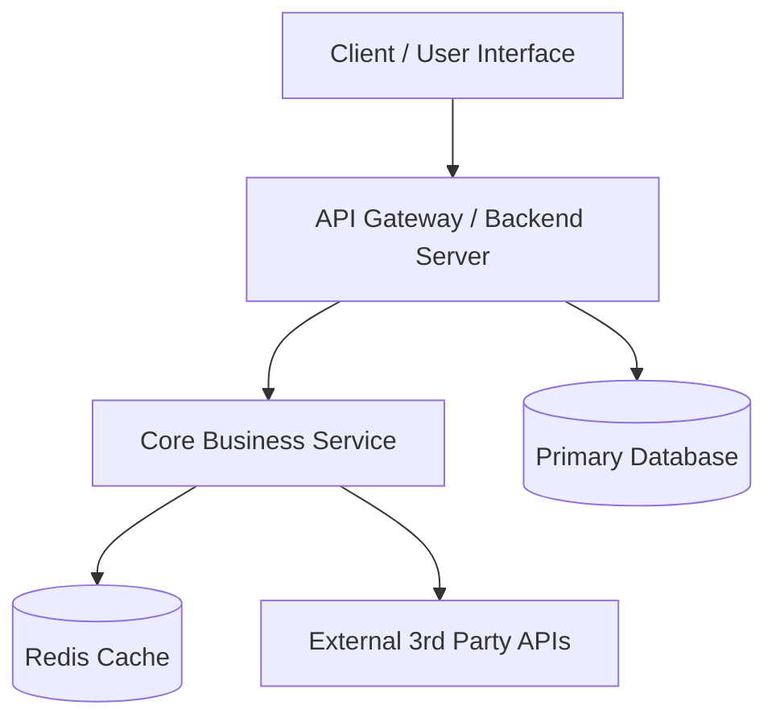

# Architecture Specification: [Project Name]

## 1. Executive Summary & Objectives
- **Project Purpose**: High-level problem statement and business objective.
- **Core Value Proposition**: Key problems solved for users and stakeholders.
- **Success Metrics (KPIs)**: Measurable criteria for project success (e.g. latency, throughput, conversion rate).

## 2. System Overview & Architecture Diagram
- **High-Level Diagram**: Mermaid diagram of component interactions (Clients, Gateway, Services, Database, Third-Party APIs).



## 3. Technology Stack & Rationale
| Layer | Technology | Decision Rationale & Tradeoffs |
|---|---|---|
| Frontend | e.g. Next.js / React | SSR/SSG capabilities, ecosystem maturity |
| Backend | e.g. Node.js / Python / Go | High I/O performance, strong typing |
| Database | e.g. PostgreSQL / Supabase | Relational integrity, ACID compliance |
| Cache/Queue | e.g. Redis | In-memory latency, pub/sub capabilities |
| Testing | e.g. Jest / Pytest | Test-Driven Development ecosystem |

## 4. Component Design & Responsibilities
- **Component 1 (e.g., Auth & Session Manager)**: Responsibilities, interfaces, state management.
- **Component 2 (e.g., Core Engine / Domain Service)**: Business logic boundaries, dependencies.
- **Component 3 (e.g., Data Access Layer)**: ORM / SQL query boundaries, connection pooling.

## 5. Data Architecture & Schema
- **Entity Relationship Overview**:
- **Core Tables / Collections**:
  - Columns, Data Types, Constraints, Indexes.
  - Foreign Key relationships and cascading rules.
- **Migration Strategy**: Versioning, rollback considerations, zero-downtime guidelines.

## 6. API Contracts & Communication Protocols
- **Protocol**: RESTful JSON / GraphQL / gRPC / WebSockets
- **Standard Error Response Format**:
```json
{
  "success": false,
  "error": {
    "code": "RESOURCE_NOT_FOUND",
    "message": "Human-readable description",
    "details": {}
  }
}
```
- **Endpoints Specification**:
  - `METHOD /api/v1/resource`: Request parameters, headers, payload, and response schemas.

## 7. Security Architecture & Threat Modeling
- **Authentication & Authorization**: JWT, OAuth2, RBAC matrix.
- **Data Protection**: Encryption at rest (AES-256), encryption in transit (TLS 1.3).
- **Secrets Management**: Environment variables, Vault/Secret Manager.
- **Input Sanitization**: Schema validation (e.g. Zod / Pydantic) at all boundaries.

## 8. Scalability, Resilience & Observability
- **Error Handling & Retries**: Circuit breakers, exponential backoff.
- **Logging & Monitoring**: Structured JSON logs, trace IDs, health check endpoints (`/healthz`).
- **Backup & Disaster Recovery**: RPO (Recovery Point Objective) and RTO (Recovery Time Objective).
