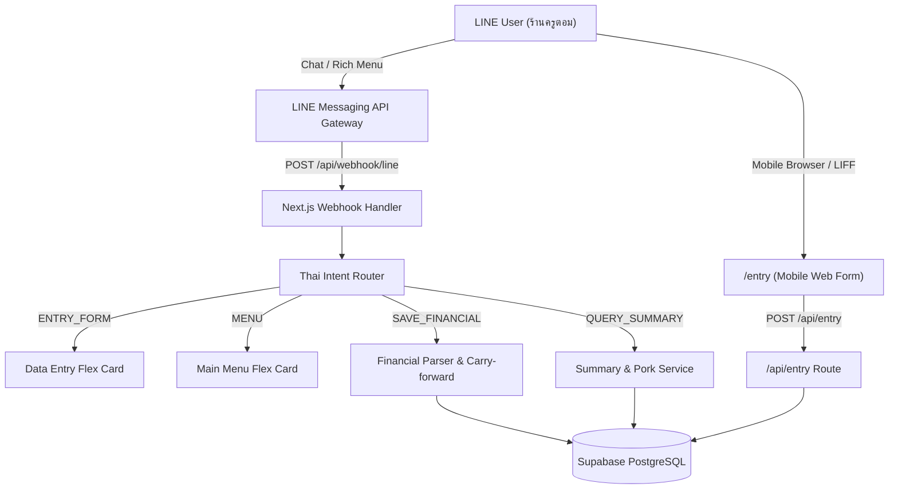

# Architecture Specification: LINE Dashboard Bot (ร้านครูตอม)

## 1. Executive Summary & Objectives
- **Project Purpose**: Serverless bookkeeping and financial management bot via LINE Messaging API for "ร้านครูตอม".
- **Core Value Proposition**: Enables staff to log daily branch revenue (โอน, สด, delivery), pork consumption (แดง, สับ, มัน), and expenses (แม็คโคร, ค่าแรง, แก๊ส) via conversational Thai text, photos/slips (OCR), voice messages, or an interactive mobile entry table.
- **Success Metrics**: Zero-friction data entry (<10s per day), zero downtime, 100% calculation accuracy for daily profits.

## 2. System Overview & Architecture Diagram

## 3. Technology Stack & Rationale
| Layer | Technology | Decision Rationale & Tradeoffs |
|---|---|---|
| Frontend | Next.js 16 (App Router) + React 19 | Fast mobile rendering, server components, seamless API collocation |
| Backend | Node.js Serverless on Vercel | Instant autoscaling, zero idle cost, high availability |
| Database | Supabase (PostgreSQL 15) | Relational integrity, JSONB support for pork breakdowns, real-time sync |
| NLP / AI | Hybrid Rule-Based + Gemini / Groq | Deterministic regex for numbers + LLM fallback for conversational intent |
| Messaging | LINE Messaging API (Flex 1.4) | Rich interactive bubble cards, persistent 6-tile Rich Menu |
| Testing | Jest + ts-jest (191 tests) | Strict Test-Driven Development with 100% regression safety |

## 4. Menu & Data Entry Architecture
- **6-Tile Menu Bar**:
  - Tile 1: 📝 กรอกรายรับ-รายจ่าย (`ENTRY_FORM`)
  - Tile 2: 📊 สรุปวันนี้ (`QUERY_SUMMARY`)
  - Tile 3: 🥩 เช็คยอดหมู (`QUERY_PORK`)
  - Tile 4: 🏪 สรุป ตลาดญี่ปุ่น (Branch 1)
  - Tile 5: 🏪 สรุป สายหนองปิง (Branch 2)
  - Tile 6: ❓ ช่วยเหลือ / คู่มือ (`HELP`)
- **Quick Reply Decoupling**: Default responses no longer force intrusive quick reply pills.
- **Mobile Entry Table (`/entry`)**: Standalone, touch-friendly accounting table with client-side reactive profit calculation and direct persistence to `/api/entry`.

## 5. Security & Threat Modeling
- **Signature Validation**: HMAC-SHA256 timing-safe validation on all LINE webhooks.
- **Rate Limiting**: Sliding window rate-limiting per IP on webhooks and `/api/entry`.
- **Zod Schema Validation**: All payloads validated with strict type boundaries (`CreateRecordSchema`).
- **Secrets Management**: Zero credentials stored in source code; managed via Vercel & Supabase env variables.
